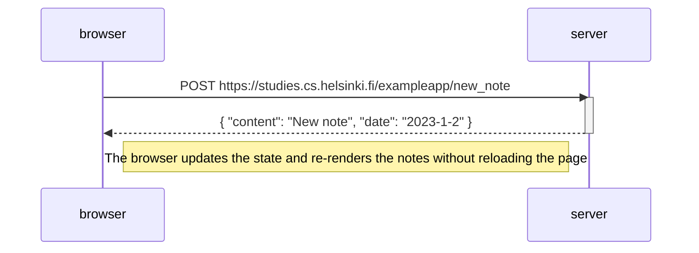

```mermaid
sequenceDiagram
    participant browser
    participant server

    browser->>server: POST https://studies.cs.helsinki.fi/exampleapp/new_note
    activate server
    server-->>browser: { "content": "New note", "date": "2023-1-2" }
    deactivate server

    Note right of browser: The browser updates the state and re-renders the notes without reloading the page

```
